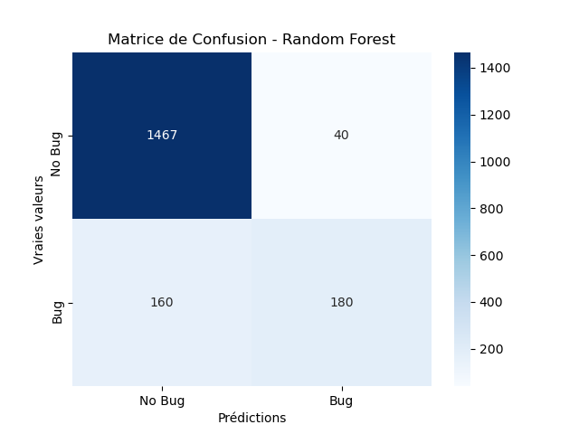
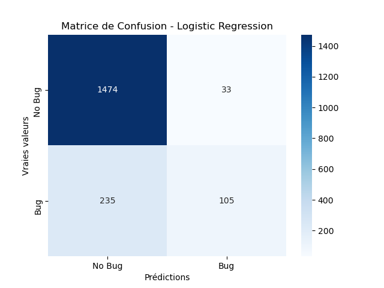
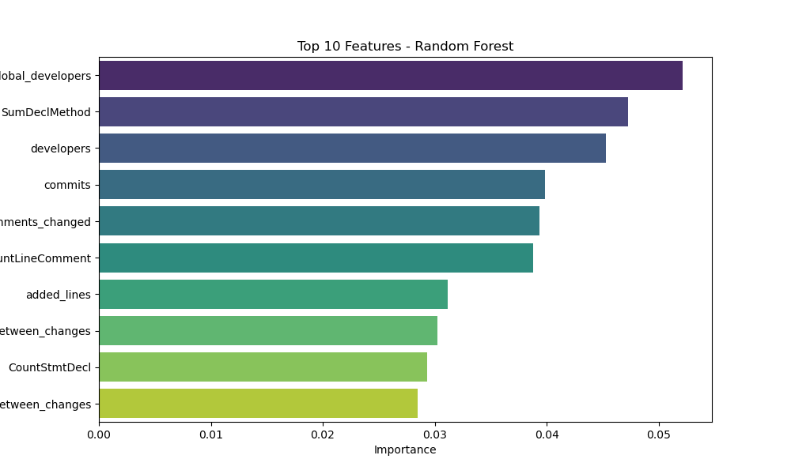
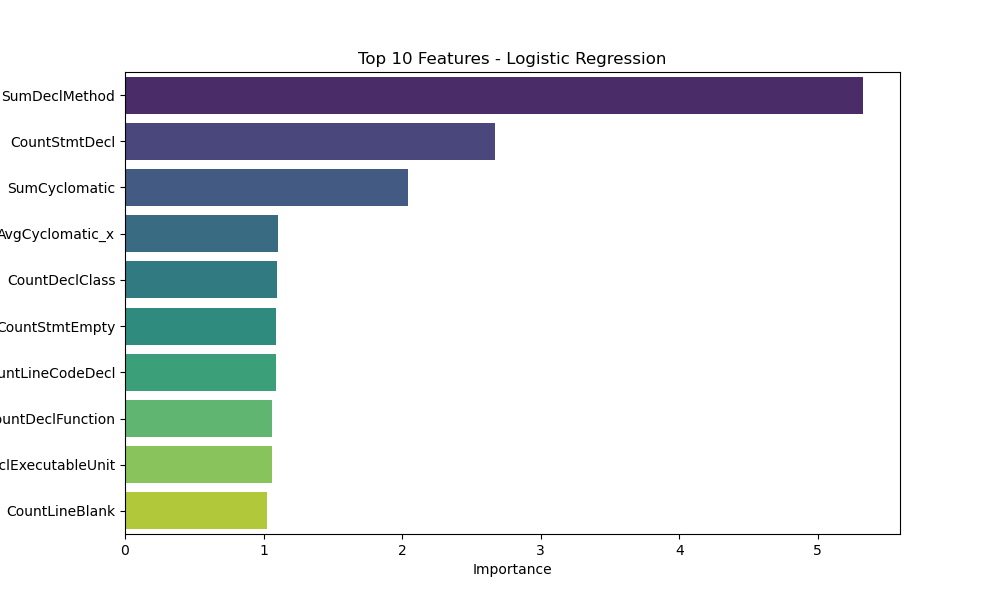

# Model Evaluation Results

## Metrics
| Model               |      AUC |   Precision |   Recall |
|:--------------------|---------:|------------:|---------:|
| Logistic Regression | 0.797094 |    0.724161 | 0.308303 |
| Random Forest       | 0.908875 |    0.786049 | 0.519656 |

## Visualizations
### Matrice de Confusion
|**Random Forest** | **Logistic Regression**|
:-----------------:|:-----------------------:
 | 

### Feature Importances
**Random Forest**
| Feature                             |   Importance |
|:------------------------------------|-------------:|
| global_developers                   |    0.0521437 |
| SumDeclMethod                       |    0.0472492 |
| developers                          |    0.0453079 |
| commits                             |    0.0398715 |
| comments_changed                    |    0.0393559 |
| CountLineComment                    |    0.0388152 |
| added_lines                         |    0.0311278 |
| average_time_between_changes        |    0.0302502 |
| CountStmtDecl                       |    0.0292857 |
| global_average_time_between_changes |    0.0284984 |
---

**Logistic Regression**
| Feature                 |   Importance |
|:------------------------|-------------:|
| SumDeclMethod           |      5.32675 |
| CountStmtDecl           |      2.67226 |
| SumCyclomatic           |      2.04052 |
| AvgCyclomatic_x         |      1.10252 |
| CountDeclClass          |      1.09926 |
| CountStmtEmpty          |      1.09289 |
| CountLineCodeDecl       |      1.09032 |
| CountDeclFunction       |      1.06125 |
| CountDeclExecutableUnit |      1.06038 |
| CountLineBlank          |      1.02455 |

|**Random Forest** | **Logistic Regression**|
:-----------------:|:-----------------------:
 | 
