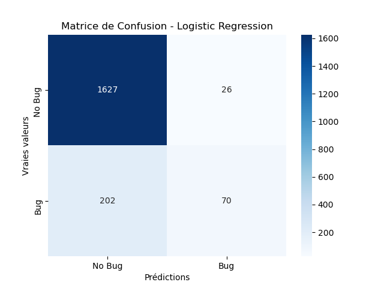
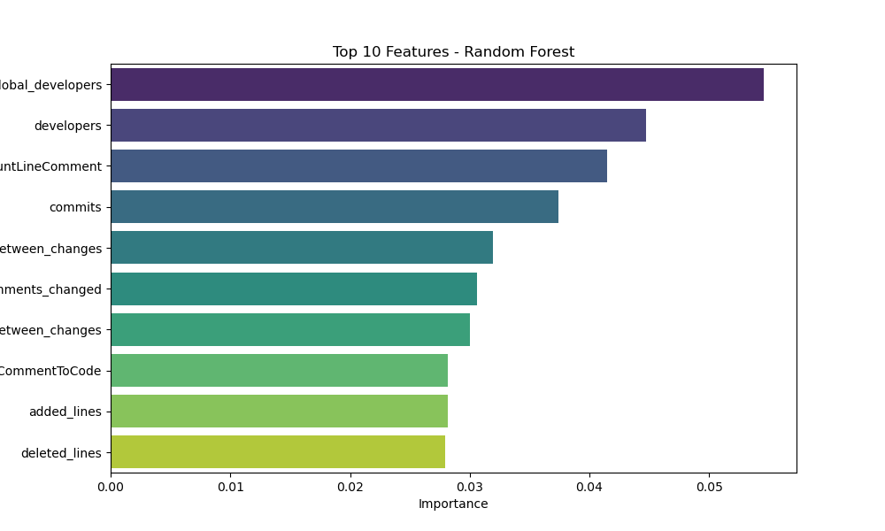
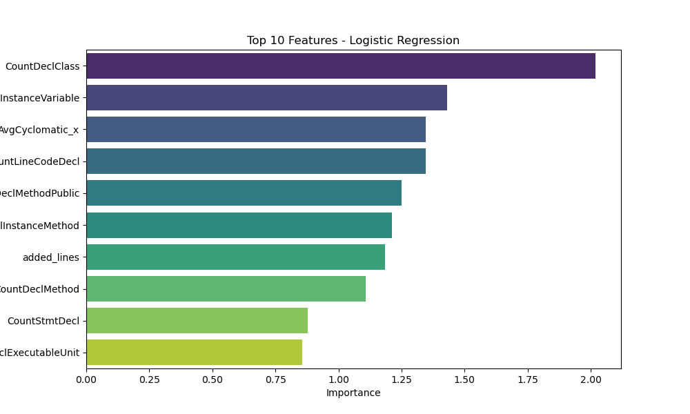

# Model Evaluation Results

## Metrics
| Model               |      AUC |   Precision |   Recall |
|:--------------------|---------:|------------:|---------:|
| Logistic Regression | 0.773183 |    0.71857  | 0.271111 |
| Random Forest       | 0.910516 |    0.769616 | 0.540192 |

## Visualizations
### Matrice de Confusion
|**Random Forest** | **Logistic Regression**|
:-----------------:|:-----------------------:
 | 

### Feature Importances
**Random Forest**
| Feature                             |   Importance |
|:------------------------------------|-------------:|
| global_developers                   |    0.0545617 |
| developers                          |    0.0447195 |
| CountLineComment                    |    0.0414889 |
| commits                             |    0.0373906 |
| global_average_time_between_changes |    0.031932  |
| comments_changed                    |    0.0306063 |
| average_time_between_changes        |    0.0300065 |
| RatioCommentToCode                  |    0.0281887 |
| added_lines                         |    0.0281341 |
| deleted_lines                       |    0.0279657 |
---

**Logistic Regression**
| Feature                   |   Importance |
|:--------------------------|-------------:|
| CountDeclClass            |     2.01876  |
| CountDeclInstanceVariable |     1.43044  |
| AvgCyclomatic_x           |     1.34689  |
| CountLineCodeDecl         |     1.34514  |
| CountDeclMethodPublic     |     1.2503   |
| CountDeclInstanceMethod   |     1.21066  |
| added_lines               |     1.18325  |
| CountDeclMethod           |     1.10856  |
| CountStmtDecl             |     0.877825 |
| CountDeclExecutableUnit   |     0.856741 |

|**Random Forest** | **Logistic Regression**|
:-----------------:|:-----------------------:
 | 
