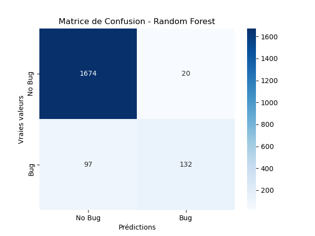
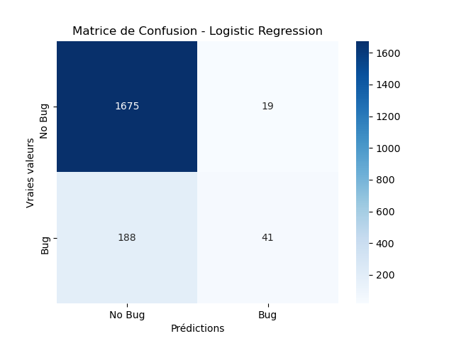
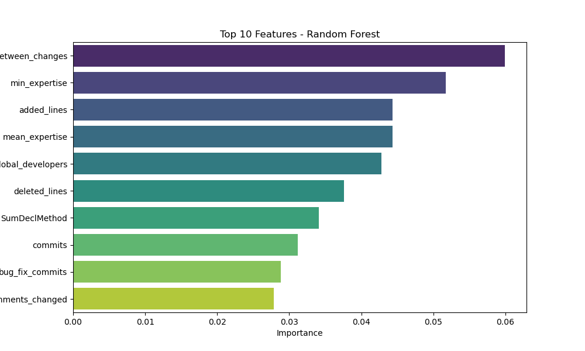
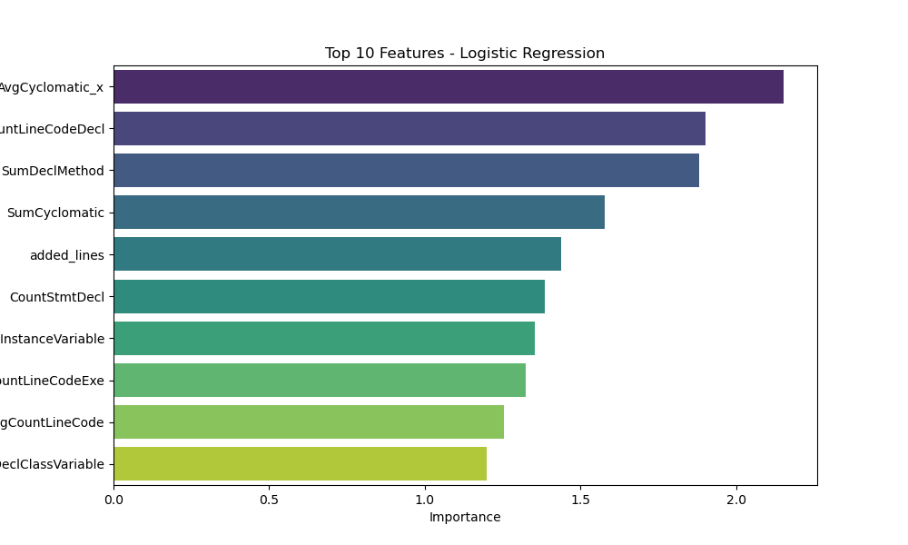

# Model Evaluation Results

## Metrics
| Model               |      AUC |   Precision |   Recall |
|:--------------------|---------:|------------:|---------:|
| Logistic Regression | 0.758774 |    0.661628 | 0.178003 |
| Random Forest       | 0.919922 |    0.824365 | 0.536628 |

## Visualizations
### Matrice de Confusion
|**Random Forest** | **Logistic Regression**|
:-----------------:|:-----------------------:
 | 

### Feature Importances
**Random Forest**
| Feature                             |   Importance |
|:------------------------------------|-------------:|
| global_average_time_between_changes |    0.0599283 |
| min_expertise                       |    0.051725  |
| added_lines                         |    0.0443481 |
| mean_expertise                      |    0.044332  |
| global_developers                   |    0.0428101 |
| deleted_lines                       |    0.0375696 |
| SumDeclMethod                       |    0.0341379 |
| commits                             |    0.0312165 |
| bug_fix_commits                     |    0.0288567 |
| comments_changed                    |    0.0278255 |
---

**Logistic Regression**
| Feature                   |   Importance |
|:--------------------------|-------------:|
| AvgCyclomatic_x           |      2.15253 |
| CountLineCodeDecl         |      1.90128 |
| SumDeclMethod             |      1.87977 |
| SumCyclomatic             |      1.57717 |
| added_lines               |      1.43917 |
| CountStmtDecl             |      1.3861  |
| CountDeclInstanceVariable |      1.35337 |
| CountLineCodeExe          |      1.32448 |
| AvgCountLineCode          |      1.25433 |
| CountDeclClassVariable    |      1.19799 |

|**Random Forest** | **Logistic Regression**|
:-----------------:|:-----------------------:
 | 
