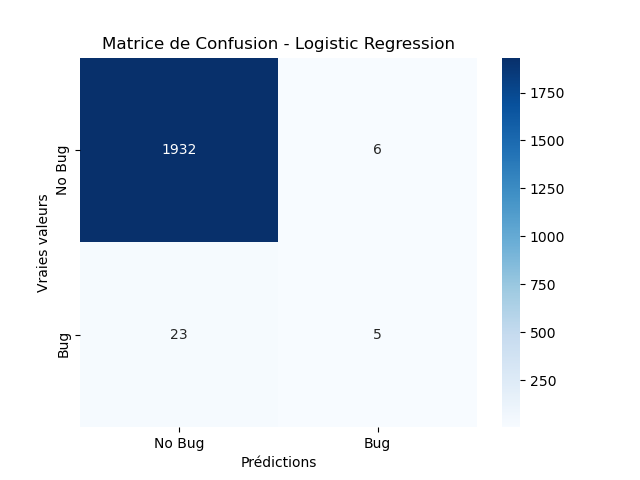
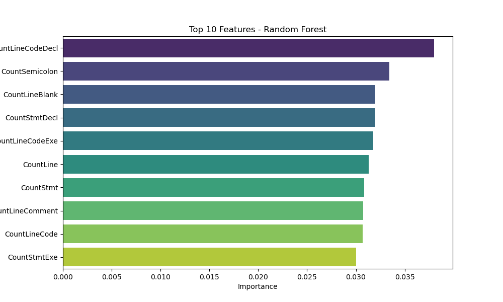
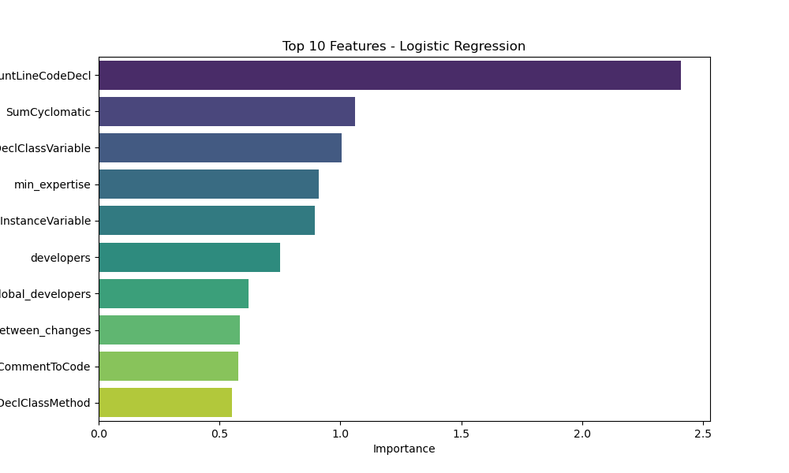

# Model Evaluation Results

## Metrics
| Model               |      AUC |   Precision |    Recall |
|:--------------------|---------:|------------:|----------:|
| Logistic Regression | 0.750548 |    0.376467 | 0.10606   |
| Random Forest       | 0.750222 |    0.614833 | 0.0894504 |

## Visualizations
### Matrice de Confusion
|**Random Forest** | **Logistic Regression**|
:-----------------:|:-----------------------:
 | 

### Feature Importances
**Random Forest**
| Feature           |   Importance |
|:------------------|-------------:|
| CountLineCodeDecl |    0.0380117 |
| CountSemicolon    |    0.0334341 |
| CountLineBlank    |    0.0319814 |
| CountStmtDecl     |    0.0319567 |
| CountLineCodeExe  |    0.0317653 |
| CountLine         |    0.0313064 |
| CountStmt         |    0.0308604 |
| CountLineComment  |    0.0307567 |
| CountLineCode     |    0.0307182 |
| CountStmtExe      |    0.030038  |
---

**Logistic Regression**
| Feature                             |   Importance |
|:------------------------------------|-------------:|
| CountLineCodeDecl                   |     2.40932  |
| SumCyclomatic                       |     1.06219  |
| CountDeclClassVariable              |     1.00585  |
| min_expertise                       |     0.910659 |
| CountDeclInstanceVariable           |     0.894103 |
| developers                          |     0.749352 |
| global_developers                   |     0.621429 |
| global_average_time_between_changes |     0.585658 |
| RatioCommentToCode                  |     0.578952 |
| CountDeclClassMethod                |     0.550277 |

|**Random Forest** | **Logistic Regression**|
:-----------------:|:-----------------------:
 | 
