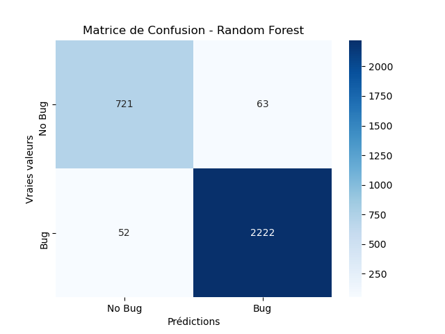
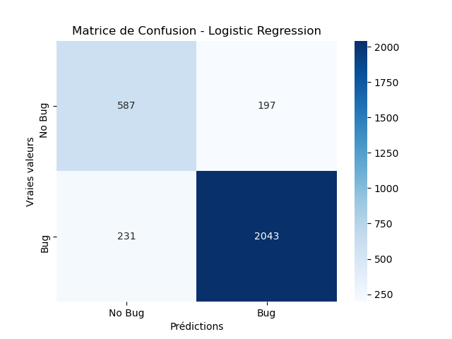
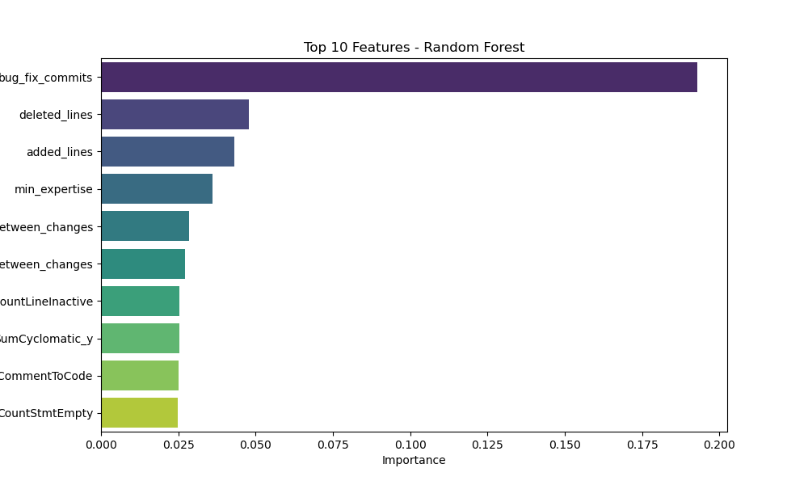
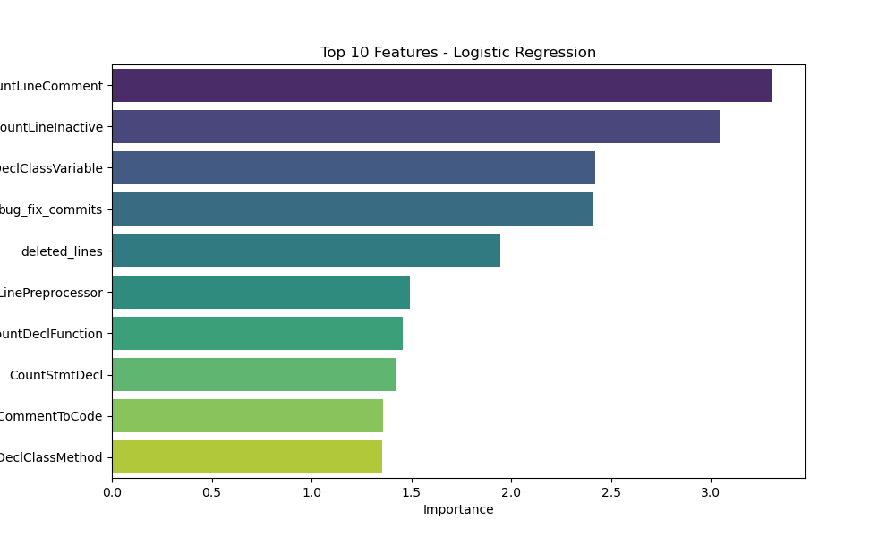

# Model Evaluation Results

## Metrics
| Model               |      AUC |   Precision |   Recall |
|:--------------------|---------:|------------:|---------:|
| Logistic Regression | 0.894677 |    0.912948 | 0.892079 |
| Random Forest       | 0.989492 |    0.965679 | 0.975786 |

## Visualizations
### Matrice de Confusion
|**Random Forest** | **Logistic Regression**|
:-----------------:|:-----------------------:
 | 

### Feature Importances
**Random Forest**
| Feature                             |   Importance |
|:------------------------------------|-------------:|
| bug_fix_commits                     |    0.192897  |
| deleted_lines                       |    0.0479423 |
| added_lines                         |    0.0430643 |
| min_expertise                       |    0.036128  |
| global_average_time_between_changes |    0.028546  |
| average_time_between_changes        |    0.0271603 |
| CountLineInactive                   |    0.0254558 |
| SumCyclomatic_y                     |    0.0252651 |
| RatioCommentToCode                  |    0.0251289 |
| CountStmtEmpty                      |    0.0248984 |
---

**Logistic Regression**
| Feature                |   Importance |
|:-----------------------|-------------:|
| CountLineComment       |      3.30772 |
| CountLineInactive      |      3.04898 |
| CountDeclClassVariable |      2.41868 |
| bug_fix_commits        |      2.40884 |
| deleted_lines          |      1.94451 |
| CountLinePreprocessor  |      1.49386 |
| CountDeclFunction      |      1.45612 |
| CountStmtDecl          |      1.42533 |
| RatioCommentToCode     |      1.35814 |
| CountDeclClassMethod   |      1.35337 |

|**Random Forest** | **Logistic Regression**|
:-----------------:|:-----------------------:
 | 
