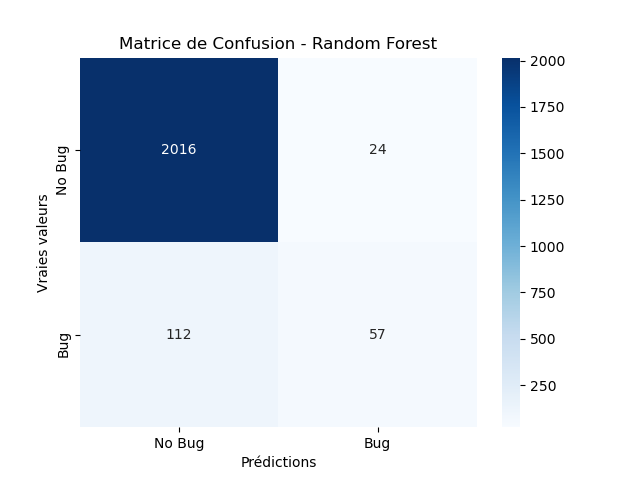
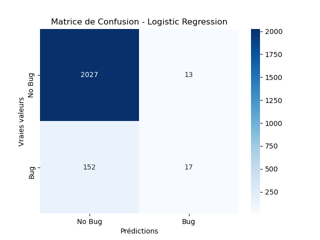
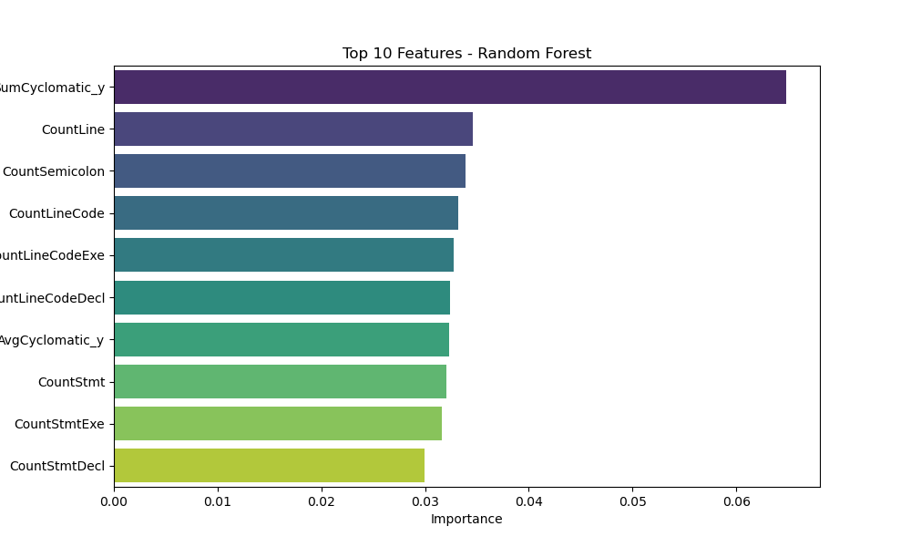
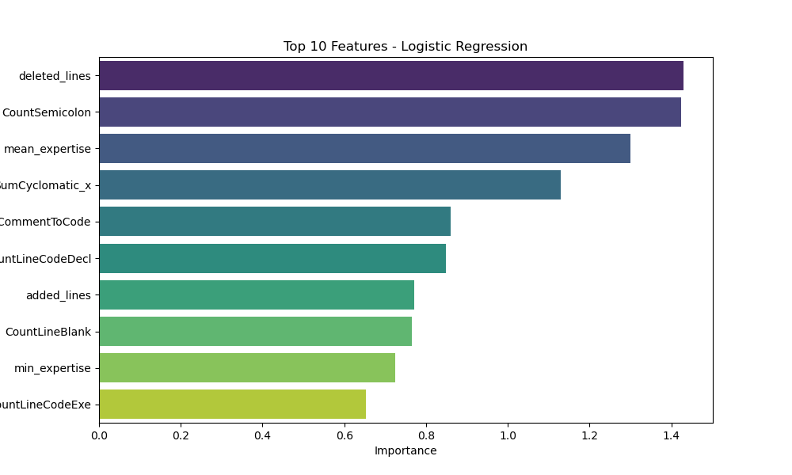

# Model Evaluation Results

## Metrics
| Model               |      AUC |   Precision |   Recall |
|:--------------------|---------:|------------:|---------:|
| Logistic Regression | 0.735561 |    0.584676 | 0.108471 |
| Random Forest       | 0.869778 |    0.745959 | 0.358981 |

## Visualizations
### Matrice de Confusion
|**Random Forest** | **Logistic Regression**|
:-----------------:|:-----------------------:
 | 

### Feature Importances
**Random Forest**
| Feature           |   Importance |
|:------------------|-------------:|
| SumCyclomatic_y   |    0.0648231 |
| CountLine         |    0.0346382 |
| CountSemicolon    |    0.0338829 |
| CountLineCode     |    0.0332309 |
| CountLineCodeExe  |    0.0327793 |
| CountLineCodeDecl |    0.0323674 |
| AvgCyclomatic_y   |    0.0323448 |
| CountStmt         |    0.0320228 |
| CountStmtExe      |    0.0316156 |
| CountStmtDecl     |    0.0299563 |
---

**Logistic Regression**
| Feature            |   Importance |
|:-------------------|-------------:|
| deleted_lines      |     1.42995  |
| CountSemicolon     |     1.4238   |
| mean_expertise     |     1.30063  |
| SumCyclomatic_x    |     1.13032  |
| RatioCommentToCode |     0.860326 |
| CountLineCodeDecl  |     0.849031 |
| added_lines        |     0.771643 |
| CountLineBlank     |     0.764906 |
| min_expertise      |     0.724277 |
| CountLineCodeExe   |     0.6536   |

|**Random Forest** | **Logistic Regression**|
:-----------------:|:-----------------------:
 | 
